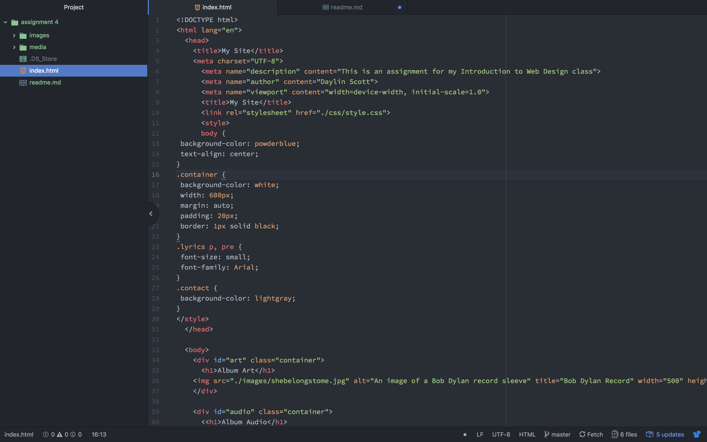

# Technical Report
## Briefly describe the difference between divs, classes, ids, and spans
Id's are a unique identifier to a specific element in html, class groups similar types of elements together using the same name value, divs create an element to block other elements together and are used to increase structural clarity, and last but certainly not least are spans which are used within divs to provide more organization and/or extra styling.

## What is "alt text," and why do we use it?
Alt text or alternative text is a word or phrase that can be used in an html document to tell viewers of the nature of a specific content or image.

## My Work Cycle
I had some initial trouble wrapping my head around all of the new concepts introduced this week, but after going over the course module a few more times, things became more clear and the assignment was fairly easy. I did have some trouble towards the end with the multiple source video, but I just went back to the module and walked myself through it a few times and I eventually got it figured out. I cannot stress how much I appreciate the conciseness of the instructions for this class, it makes everything so much easier.

## screenshot

